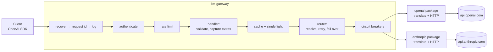
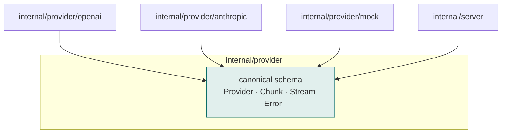
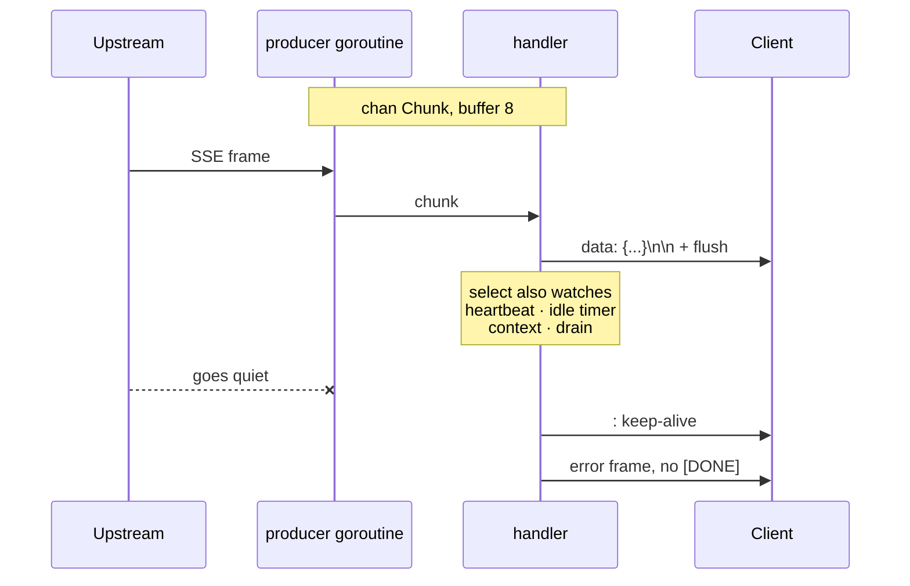
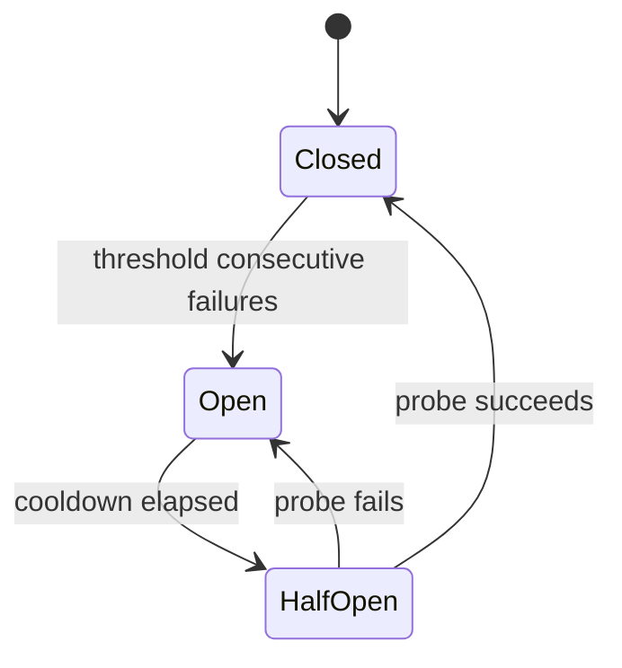

# Architecture

How the gateway is put together and why. For what each knob does, see the
[README](../README.md); for the decisions and their reasoning as they were
made, see [PROGRESS.md](../PROGRESS.md).

## The shape of a request

The order of the middleware is not arbitrary:

- **recover** is outermost, so a panic anywhere below still produces an answer
  or a clean abort rather than a dangling connection.
- **request id** comes before logging, so every line about a request can be
  tied to it.
- **authenticate** precedes **rate limit**, because a bucket has to be keyed on
  a caller. Keying it on an address would make everyone behind one NAT share an
  allowance, and let anyone who changes address get a fresh one.
- **cache** sits inside the limiter: a cached answer still costs the caller a
  token. Serving unlimited traffic from cache would let one client monopolise
  the gateway's own capacity.

## The dependency rule

Arrows only point inwards. `internal/provider` defines the canonical schema and
imports no vendor package; the vendor packages import it. This is what makes
adding a provider a matter of writing one new package rather than editing every
existing one.

Go enforces it rather than leaving it to discipline: the reverse would be an
import cycle, which is a compile error.

## Two vendors, one contract

The dialects disagree on almost everything that matters:

| | OpenAI | Anthropic |
|---|---|---|
| Endpoint | `/chat/completions` | `/messages` |
| Auth | `Authorization: Bearer` | `x-api-key` + `anthropic-version` |
| System prompt | a message in the list | a top-level field |
| `max_tokens` | optional | **required** |
| Response content | a string | an array of typed blocks |
| Stop reasons | `stop`, `length`, `tool_calls` | `end_turn`, `max_tokens`, `stop_sequence`, `tool_use` |
| Token counts | one object | split across two events when streaming |
| Stream ends with | `data: [DONE]` | `message_stop`, then the connection closes |

Each vendor package owns its own vocabulary end to end: wire types, error
envelope, SSE parsing and the translation both ways. None of it is visible from
outside the package. The gateway supplies Anthropic's mandatory `max_tokens`
itself, because leaking that requirement to clients would mean the same request
is valid or invalid depending on which vendor happens to be behind the model
name — and would break failover for every request that omits it.

## Streaming

The handler cannot simply loop on the upstream stream: parked inside a read it
can do nothing else, and it has four other things to watch. So a goroutine turns
the blocking source into a channel and the handler multiplexes with `select`.

Two rules keep that safe:

- **The stream has one owner.** The producer goroutine calls `Next`, `Current`
  and `Close`; the handler stops it by cancelling the context and never touches
  it. The race detector found the alternative during development.
- **Every send is inside a `select` with the context.** A bare send on a channel
  nobody is reading blocks forever, and takes the upstream connection and its
  file descriptor with it.

The buffer is 8. Small enough that a slow client propagates backpressure all the
way to the upstream socket; large enough that the producer does not stall on
every token. A large buffer would convert a latency problem into a memory one.

## Resilience

A request walks its model's chain. Each provider gets up to `RetryAttempts`
tries with jittered exponential backoff, then the chain moves on and the model
is rewritten for the next vendor. Only retryable failures move the chain: a 400
is returned verbatim, because asking a second vendor the same malformed question
wastes everyone's time.

Half-open lets exactly one probe through. Letting a crowd in on the first
hopeful moment puts the provider straight back under the load that broke it.

Three things deliberately degrade rather than cascade: a limiter outage fails
open, a cache outage reads as a miss, and an unresolvable fallback target is
skipped. Each is a smaller failure than the alternative.

## Where state lives

| State | In process | Shared |
|---|---|---|
| Rate limit buckets | correct for one instance | Redis, via a Lua script |
| Response cache | replicas miss each other's entries | Redis |
| Circuit breakers | per instance, deliberately | — |
| API keys | loaded at startup, as digests | — |

The limiter needs atomicity because two replicas both reading "one token left"
both allow, and the effective limit multiplies by the instance count. The cache
does not: storing an answer twice is redundant, not wrong.

Circuit breakers stay per instance on purpose. A provider failing for one
replica and not another is information, and sharing the state would let one
instance's network trouble take a healthy provider away from everyone.
